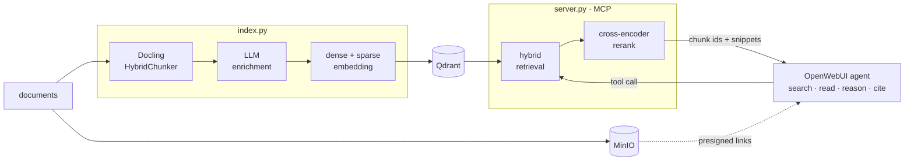

<p align="center">
  
</p>

<h1 align="center">A-RAG-OG</h1>

<p align="center">
  <b>Agentic RAG, Off Grid</b> — a self-hosted retrieval <b>MCP server</b> for OpenWebUI.
</p>

<p align="center">
  
  
  
  
</p>

---

## ✨ What it is

A-RAG-OG indexes documents into a single hybrid (dense + sparse) Qdrant store and exposes
retrieval as MCP tools. The agent lives in OpenWebUI — its model decides which tool to call,
searches in several rounds, reads promising chunks and grounds its answer. This service
stays a thin, stateless retrieval layer.

Enrichment adds context, keywords, hypothetical questions, entities and dates to every
chunk — the metadata `filtered_search` filters on.



---

## 🚀 Quick Start

One compose file runs the whole stack: MCP server, MinIO, Qdrant, Docling, embedder and
reranker. **Requires** Docker, plus the NVIDIA container toolkit for the bundled embedder
and reranker. Every endpoint is a plain OpenAI-compatible URL, so pointing
`DENSE_EMBEDDING_URL` / `RERANKER_URL` at an external service drops both the GPU and those
two containers.

### 1. Configure

```bash
git clone https://github.com/Th3R3alDuk3/Aragog.git
cd Aragog
cp .env.example .env
```

Everything is configured in `.env`. [.env.example](.env.example) lists every variable and
documents the non-obvious constraints inline; four entries need a real value, the rest has
working defaults:

| Variable | Set it to |
|:---|:---|
| `ENRICHER_URL`<br>`ENRICHER_MODEL`<br>`ENRICHER_TOKEN` | An OpenAI-compatible endpoint whose model supports structured output (`json_schema`).<br>Preset is OpenRouter + `deepseek/deepseek-v4-flash` — just add your key. |
| `MINIO_PUBLIC_URL` | The address a **browser** reaches MinIO at, e.g. `http://192.168.1.10:9000`.<br>Source links are presigned for this host. |
| `JWT_SECRET` | OpenWebUI's own secret key — the server verifies OpenWebUI's JWTs with it. |
| `MINIO_PASSWORD`<br>`QDRANT_TOKEN`<br>… | Your own passwords (every example says `whatever`). |

### 2. Start

```bash
docker compose up -d --build
```

The first start downloads the embedding and reranking models into `./data/huggingface`,
which takes a while. Name the services you want to skip the bundled ones, e.g.
`docker compose up -d --build server minio qdrant docling`.

### 3. Index documents

```bash
docker compose run --rm -v ./mydocs:/docs server python index.py /docs/doc1.pdf
```

Pass any number of paths; `-b/--batch-size` and `-c/--concurrency` control throughput. Every
batch prints its result, so a working setup looks like `[1/1] 1 file(s) → 42 chunk(s)`.

> [!WARNING]
> `ENRICHER_LANGUAGE` and `SPARSE_EMBEDDING_LANGUAGE` must be identical, and stay identical
> between indexing and querying — otherwise BM25 silently stops matching.

> [!NOTE]
> Chunk ids are derived from source, position and content, so re-indexing unchanged files
> updates them in place and a failed run can simply be repeated. Changed content gets new
> ids and the old chunks stay behind — rebuild the collection after editing files or
> swapping the converter/chunker.

### 4. Connect OpenWebUI

Point OpenWebUI's MCP integration at `http://HOST:8000/mcp` (streamable-http), then give
that model the system prompt from [PROMPT.md](PROMPT.md), which enforces the
search → read → cite workflow.

---

## 🧰 MCP Tools

| Tool | Purpose |
|:---|:---|
| `keyword_and_semantic_search(query)` | **Default** — dense + sparse, fused by reranker |
| `semantic_search(query)` | Dense retrieval (by meaning) + rerank |
| `keyword_search(query)` | Sparse/BM25 retrieval (exact terms) + rerank |
| `filtered_search(query, …)` | Hybrid + filter on keywords, entities, content types, dates |
| `find_related(chunk_ids, query, …)` | More chunks mentioning the same entities as a hit |
| `read_chunks(chunk_ids)` | Full content of chunks by id |
| `read_neighbors(chunk_ids, window)` | Full content of the chunks surrounding a hit |

Searches return chunk ids with snippets — the agent picks from those and reads on.

---

## 🛠️ Development

Needs `uv` and Python 3.14. Run the backing services in Docker and the server on the host —
they are published locally, so first point `.env` at localhost instead of the compose
hostnames:

| Variable | Host value |
|:---|:---|
| `QDRANT_URL` | `http://localhost:6333` (dashboard at `/dashboard`) |
| `MINIO_URL` | `http://localhost:9000` (console on 9001) |
| `DOCLING_URL` | `http://localhost:5001` |
| `DENSE_EMBEDDING_URL` | `http://localhost:8001/v1` |
| `RERANKER_URL` | `http://localhost:8002/v1` |

```bash
docker compose up -d minio qdrant docling embedder reranker

uv run python index.py path/to/doc1.pdf     # index documents
uv run python server.py                     # run the MCP server
```

---

## 📄 License

[MIT](LICENSE)
